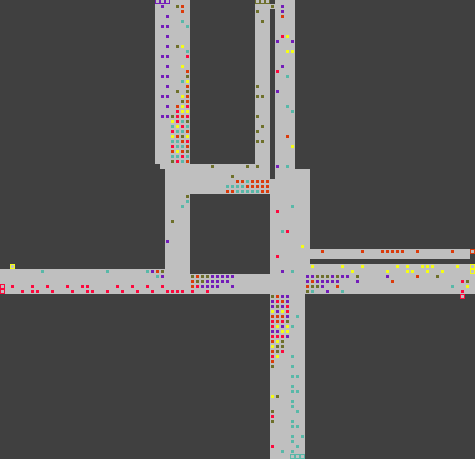

This is a basic traffic simulator which I wrote to learn Rust. You can build with `cargo build --release` and use the `--help` option to see usage of the resulting executable.

**September 2021 Update** I have made two minor commits, one to get the code working in Rust 1.55.0 and another to add this message. Otherwise this project is dormant. I have learnt a lot more since writing this (primarily through work in my [rust](https://github.com/TGElder/rust) repository) and would doubtless approach things differently were I to approach this again. When compiling I saw many clippy lints that I will not fix. 

# Map

The executable requires a map file. `hanger-lane.csv` is provided as an example; this is an approximation of the Hanger Lane Gyratory in West London. 

Run `cargo run --release hanger-lane.csv` to run it properly.

A map file is grid of cells. Each cell can contain any number of the following, separated by spaces.

## Road

Roads are a pair of symbols like `>^`, which means traffic entering the cell moving right can exit the cell moving up. Directions are represented by `^`, `>`, `v`, `<`.

### Wildcards
An asterisk `*` can be used as a wildcard: `*v` means traffic entering the cell from any direction (except up) can exit moving down. `<*` means traffic entering the cell moving left can exit moving any direction (except right). `**` is also permitted.

Note that wildcards will never allow traffic entering a cell to leave in the opposite direction (hence the exceptions above).

## Source

A source is expressed like `S^0`. Traffic will enter the map at this cell, facing the direction denoted by the second character. The number can be used for grouping sources in different cells together.

Note that a source always needs to be paired with a road leading out of the cell (e.g. `S^0 ^^`).

## Destination

A destination is expressed like `D^0`. Traffic will exit the map at this cell. The number can be used for grouping destinations in different cells together.

## Traffic Light

A traffic light is expressed like `T^3`. This means traffic will only be allowed to enter this cell moving in the direction denoted by the second character in the traffic light cycle denoted by the number.

It is possible for a cell to have rules for multiple cycles: e.g. `T^1 T^3 T<5` would mean traffic can entering moving up in the 1st and 3rd cycles, and can enter moving left in the 5th cycle.

### Traffic Light Cycles

The simulation cycles through traffic light cycles (up to the maximum number specified in the map). Even and odd cycles are different lengths; this can be adjusted with the `--even_cycle_steps` and `--odd_cycle_steps` options. It is expected that the even cycles are used to allow junctions to clear - this is a shorter period where 'all lights are red'. The longer odd cycles can be used to control when lights are green.

# How does it work?

## Spawning
Vehicles are randomly spawned at sources according to the `--spawn_frequency` parameter. Each vehicle is randomly assigned a destination (destinations are chosen with equal probability).

Spawning works at the source group level. If there are ten sources in group 0 and `--spawn_frequency=1` (vehicle spawned per source, every step), then only one of the ten sources will get a new vehicle on each step.

Destination selection also works at the destination group level. If there is one destination in group 0 and nine in group 1, then the group 0 destination will be chosen 50% of the the time (not 10%).

## Path finding
When the program starts, Dijkstra's algorithm is used to calculate the direction (at every cell on the map) to travel in order to reach every destination in the lowest number of steps.

Vehicles follow this path until it is blocked by another vehicle. In this case, they are able to lookahead a number of cells (controlled by `--lookahead`) to find another cell that is closer to the destination than their current cell. If such a cell exists, the vehicle will move towards it - even if this means temporarily moving to a cell that is further from the destination.

# Visualisation

The visualisation is simple. Vehicles are shown as solid squares, coloured according to their destination. Destinations are shown as hollow squares. Light grey areas have a road leading out of them, dark grey areas do not.
